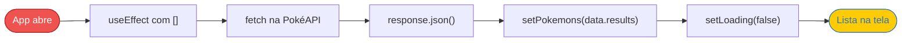
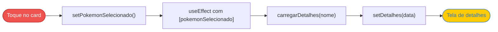
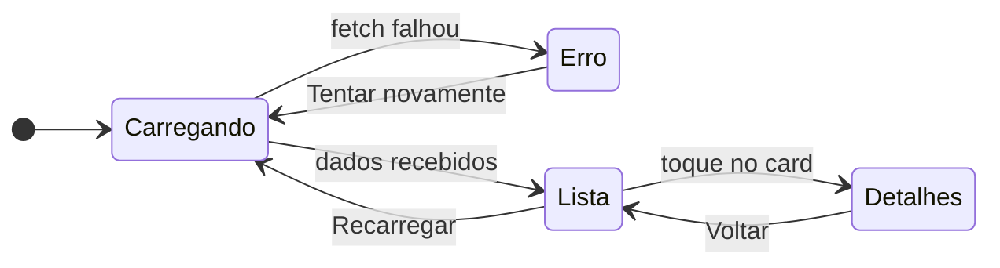

<div align="center">


# PokéDex Mobile

**Um app React Native que consome a PokéAPI para listar, pesquisar e detalhar Pokémon.**

Projeto do laboratório preparatório para prova, com foco em `useState`, `useEffect` e consumo de API REST.


[Sobre](#-sobre) • [Funcionalidades](#-funcionalidades) • [Como funciona](#-como-funciona) • [Como rodar](#-como-rodar) • [Conceitos](#-conceitos-praticados) • [Revisão](#-quiz-de-revisão)

</div>

---

## 📖 Sobre

A **PokéDex Mobile** é um aplicativo feito com **React Native + Expo** que busca dados da [PokéAPI](https://pokeapi.co/) e mostra uma lista de Pokémon com imagem, nome e número. Ao tocar em um card, o app consulta a API de novo e abre uma tela com os detalhes daquele Pokémon: altura, peso, tipos, habilidades e estatísticas.

O objetivo do projeto é praticar o fluxo mais importante do React:

<div align="center">

**API → estado → renderização**

</div>

Nenhuma biblioteca extra foi usada para as requisições: tudo é feito com o `fetch` nativo do JavaScript, e a troca entre a lista e os detalhes é feita apenas com estado, sem biblioteca de navegação.

---

## ✨ Funcionalidades

- [x] Lista com os **30 primeiros Pokémon**, carregados da PokéAPI
- [x] Cards com **imagem, nome e ID**
- [x] Nome exibido com a **primeira letra maiúscula**
- [x] **Pesquisa em tempo real** enquanto o usuário digita
- [x] Mensagem quando a pesquisa **não encontra nenhum Pokémon**
- [x] **Busca direta na API** por nome (encontra Pokémon fora da lista, como o Mewtwo)
- [x] **Tela de detalhes** com altura, peso, tipos, habilidades e estatísticas
- [x] Botões de **Recarregar**, **Tentar novamente** e **Voltar**
- [x] Estados de **carregamento** e **erro** tratados na interface

<div align="center">

<br />
<sub>O Mewtwo é o #150, então não aparece na lista de 30, mas a busca direta encontra.</sub>
</div>

---

## 🔄 Como funciona

### Quando o app abre



### Quando o usuário toca em um Pokémon



### Qual tela aparece

O `App.js` decide o que mostrar olhando os estados, nesta ordem:



---

## 🗂️ Estrutura do projeto

```
pokedex-app/
├── App.js                  # Estados, chamadas à API e decisão de qual tela mostrar
├── components/
│   ├── PokemonCard.jsx     # Card com imagem, nome e ID (recebe pokemon e onPress)
│   ├── SearchBar.jsx       # Campo de pesquisa controlado pelo estado do App
│   └── Loading.jsx         # Indicador de carregamento reutilizável
└── screens/
    └── PokemonDetail.jsx   # Tela com altura, peso, tipos, habilidades e stats
```

---

## 🚀 Como rodar

**Pré-requisitos:** [Node.js](https://nodejs.org/) (versão LTS) e o app **Expo Go** no celular ([Android](https://play.google.com/store/apps/details?id=host.exp.exponent) | [iOS](https://apps.apple.com/app/expo-go/id982107779)).

```bash
# 1. Clone o repositório
git clone https://github.com/julyanarch/pokedex-app.git
cd pokedex-app

# 2. Instale as dependências
npm install

# 3. Inicie o projeto
npm start
```

Depois é só escanear o QR Code com o Expo Go. O celular e o computador precisam estar na mesma rede Wi-Fi.

<details>
<summary><b>🛠️ Deu problema? Clique aqui</b></summary>
<br />

| Problema | Solução |
|---|---|
| *"You need to be signed in to Expo Go"* | Rode `npx expo login` no computador e entre na mesma conta no Expo Go |
| O celular não conecta | Rode `npx expo start --tunnel` |
| *"Element type is invalid... got: object"* | Procure arquivos duplicados na pasta `components` ou `screens` (ex.: `Loading.js` e `Loading.jsx`) |
| Mudanças não aparecem | Rode `npx expo start -c` para limpar o cache |
| Abrir o link no navegador mostra um texto JSON | Normal: esse link é para o Expo Go. Para ver na web, rode `npx expo install react-dom react-native-web` e aperte `w` |

</details>

---

## 🧠 Conceitos praticados

<details>
<summary><b>useState</b>: guardar valores que mudam a tela</summary>
<br />

```jsx
const [pokemons, setPokemons] = useState([]);
```

`pokemons` é o valor atual e `setPokemons` é a função que o altera. Quando o estado muda, o React **renderiza o componente de novo** com o valor novo. Uma variável comum (`let`) não faria a tela atualizar.

Estados usados no app: `pokemons`, `loading`, `erro`, `pesquisa`, `pokemonSelecionado`, `detalhes`, `loadingDetalhes` e `erroDetalhes`.

</details>

<details>
<summary><b>useEffect</b>: executar algo depois da renderização</summary>
<br />

| Array de dependências | Quando o efeito roda |
|---|---|
| `useEffect(fn, [])` | Uma vez, depois da primeira renderização (montagem) |
| `useEffect(fn, [pesquisa])` | Na montagem e sempre que `pesquisa` mudar |
| `useEffect(fn)` | Depois de **toda** renderização |

⚠️ **Cuidado:** `useEffect(() => carregarPokemons(), [pokemons])` gera um **loop infinito**, porque o efeito altera o próprio estado que ele observa.

</details>

<details>
<summary><b>fetch + async/await</b>: consumir a API</summary>
<br />

```jsx
const response = await fetch(url);
if (!response.ok) throw new Error();
const data = await response.json();
setPokemons(data.results);
```

O `await` espera a requisição terminar antes de seguir. O `response.json()` converte a resposta em objeto JavaScript. O `response.ok` é necessário porque, quando o Pokémon não existe, a API responde com status **404** sem que o `fetch` falhe sozinho.

</details>

<details>
<summary><b>Props</b>: passar dados e funções entre componentes</summary>
<br />

```jsx
<PokemonCard pokemon={item} onPress={() => setPokemonSelecionado(item)} />
```

O App envia o Pokémon e uma função para o card. O card **não altera** o estado diretamente: ele só chama `onPress` quando é tocado, avisando o App.

</details>

<details>
<summary><b>Regra dos Hooks</b>: o erro que ninguém avisa</summary>
<br />

Todos os `useState` e `useEffect` precisam ficar **antes** de qualquer `return` condicional (como `if (loading) return ...`). Caso contrário, o React mostra o erro *"Rendered more hooks than during the previous render"*.

</details>

---

## 📝 Quiz de revisão

Tente responder antes de abrir! 👀

<details>
<summary><b>1.</b> Por que a tela atualiza quando chamamos <code>setContador()</code>, mas não quando fazemos <code>contador++</code> numa variável comum?</summary>
<br />
Porque só a mudança de <b>estado</b> avisa o React que ele precisa renderizar o componente de novo. Uma variável comum muda na memória, mas a tela não fica sabendo.
</details>

<details>
<summary><b>2.</b> Qual a diferença entre <code>[]</code>, <code>[estado]</code> e não informar o array no <code>useEffect</code>?</summary>
<br />
Com <code>[]</code>, roda uma vez na montagem. Com <code>[estado]</code>, roda na montagem e sempre que aquele estado mudar. Sem array, roda depois de toda renderização.
</details>

<details>
<summary><b>3.</b> Por que a pesquisa não chama a API a cada letra digitada?</summary>
<br />
Porque o filtro trabalha sobre os Pokémon que já estão no estado <code>pokemons</code>. A lista <code>pokemonsFiltrados</code> é recalculada a cada renderização, sem nova requisição.
</details>

<details>
<summary><b>4.</b> Qual é a função de <code>response.json()</code>?</summary>
<br />
Converter o corpo da resposta HTTP (texto em formato JSON) em um objeto JavaScript que podemos usar no código, como <code>data.results</code>.
</details>

<details>
<summary><b>5.</b> Por que os dados da API são guardados em um estado e não numa variável?</summary>
<br />
Porque os dados chegam <b>depois</b> da primeira renderização. Guardando no estado, a chegada dos dados provoca uma nova renderização e a lista aparece na tela.
</details>

<details>
<summary><b>6.</b> Por que dividimos <code>height</code> e <code>weight</code> por 10?</summary>
<br />
Porque a PokéAPI informa a altura em <b>decímetros</b> e o peso em <b>hectogramas</b>. Dividindo por 10, temos metros e quilos.
</details>

---

## 🔧 Correções feitas no roteiro original

Durante o desenvolvimento, alguns pontos do roteiro do laboratório precisaram de ajuste:

- O projeto foi criado com `--template blank`, pois o template padrão atual do Expo usa Expo Router e não gera o `App.js`.
- A função `carregarDetalhes()` e os estados de detalhes não existiam no roteiro e foram implementados.
- O `PokemonCard` passou a receber `onPress` por props, já que não tem acesso ao `setPokemonSelecionado` do App.
- `setErro(null)` foi adicionado ao recarregar, para a tela de erro não ficar presa.
- Foram incluídos os imports que faltavam (`Image`, `TextInput`, `TouchableOpacity` e os componentes).

---

<div align="center">


Feito por **[julyanarch](https://github.com/julyanarch)** durante a preparação para a prova de React Native.

<sub>Dados e imagens fornecidos pela <a href="https://pokeapi.co/">PokéAPI</a>. Pokémon e seus nomes são marcas registradas da Nintendo, Game Freak e The Pokémon Company. Projeto sem fins comerciais, apenas para estudo.</sub>

</div>
